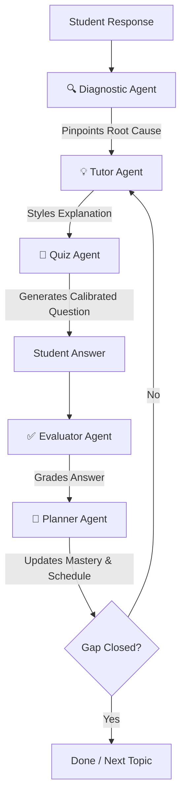

# TriAgents — Multi-Agent Adaptive Tutoring System

TriAgents is a next-generation adaptive learning platform that integrates a multi-agent orchestration loop with a hand-drawn whiteboard interactive environment. It acts as a personalized tutor, detecting student cognitive gaps, customizing explanations to individual learning styles, and automatically adjusting pacing and review intervals.

---

## 🚀 Key Features

* **Personalized Onboarding Wizard**: Guides students through learning style baseline selection, syllabus parsing, and a 10-question placement test.
* **Whiteboard Aesthetic Interface**: A clean, responsive workspace that visualizes learning progress with SVG marker highlights and handwritten typography.
* **Dynamic Tutoring Workspace**: Selects mistakes from error histories and starts a live tutoring state loop.
* **Multi-Agent Dialogue Chat Logs**: Real-time messaging visualization from five specialized agent states working in unison:
  1. 🔍 **Diagnostic Agent**: Pinpoints the root cause of conceptual errors.
  2. 💡 **Tutor Agent**: Explains concepts using 4 distinct styles (Analogy, Worked Example, Socratic, Visual).
  3. 📝 **Quiz Agent**: Automatically generates custom assessment questions matched to the student's current mastery level.
  4. ✅ **Evaluator Agent**: Grades responses dynamically and updates the knowledge profile.
  5. 🎯 **Planner Agent**: Schedules reviews using a spaced-repetition forgetting-curve model.
* **Interactive Curriculum Map**: Visualizes course graphs, topic masteries, exam weights, and prerequisite dependencies.
* **Study Roadmap Scheduler**: Re-prioritizes study topics based on exam deadlines and mastery levels.
* **Self-Healing API Rotator**: Automatically rotates API key pools, cleans JSON wrappers, and dynamically recovers from HTTP 429 rate limits.

---

## 🛠️ Technology Stack

* **Frontend**: React (Single Page Application, Whiteboard/Desk UI)
* **Backend**: FastAPI (Python 3.12)
* **Database**: SQLite (SQLAlchemy ORM) — automatically scales to PostgreSQL in cloud environments using the `DATABASE_URL` env variable.
* **AI Engine**: Groq SDK (`groq/compound` reasoning model adapter)

---

## 🏗️ Multi-Agent Architecture Workflow



---

## ⚙️ Setup & Installation

### 1. Prerequisites
Ensure you have Python 3.10+ installed on your computer.

### 2. Clone and Setup Environment
```bash
# Navigate into the project directory
cd Team-TriAgents

# Create virtual environment
python -m venv venv

# Activate virtual environment
# Windows:
.\venv\Scripts\activate
# Mac/Linux:
source venv/bin/activate

# Install dependencies
pip install -r requirements.txt
```

### 3. Configure API Credentials
Create a `.env` file in the `Team-TriAgents` folder and add your Groq API key:
```env
GROQ_API_KEY=gsk_your_actual_key_here
```

### 4. Start the Application
```bash
uvicorn api:app --reload --port 8000
```
Navigate to **`http://localhost:8000/`** in your browser to start learning!
